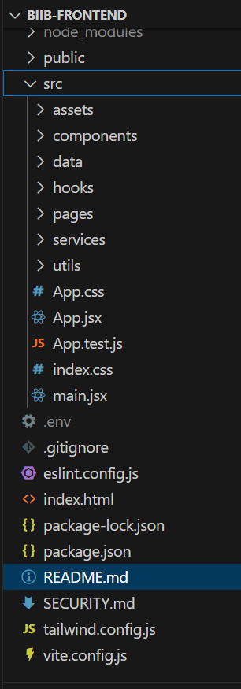
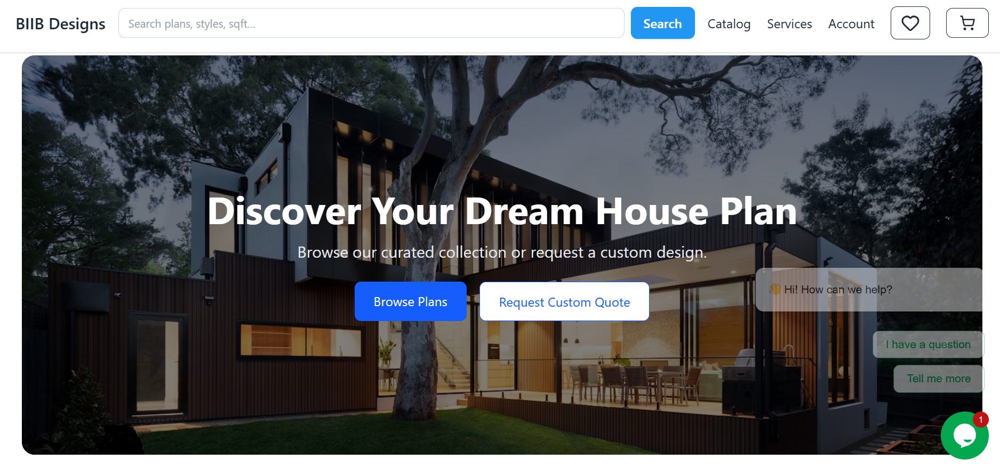
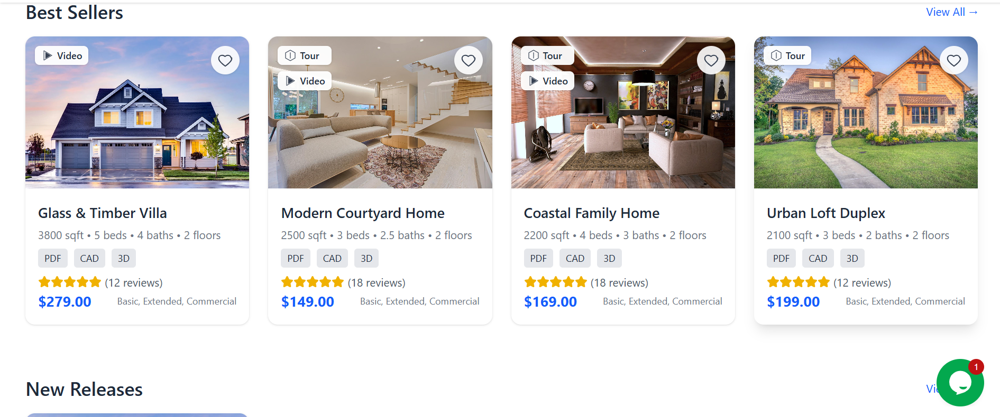
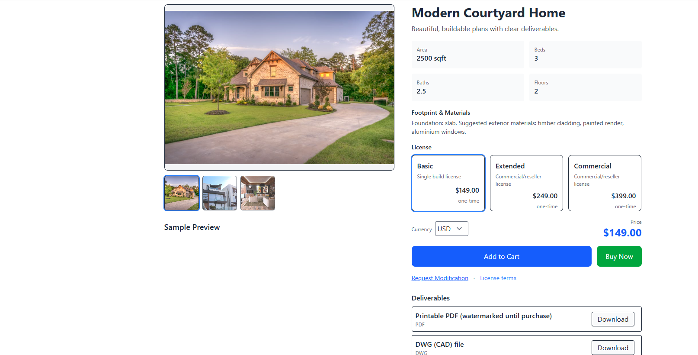
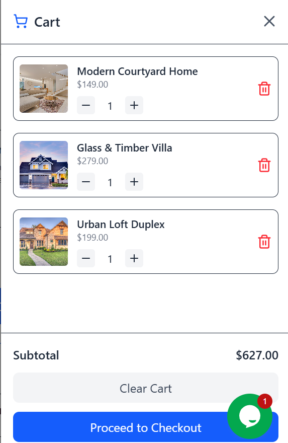
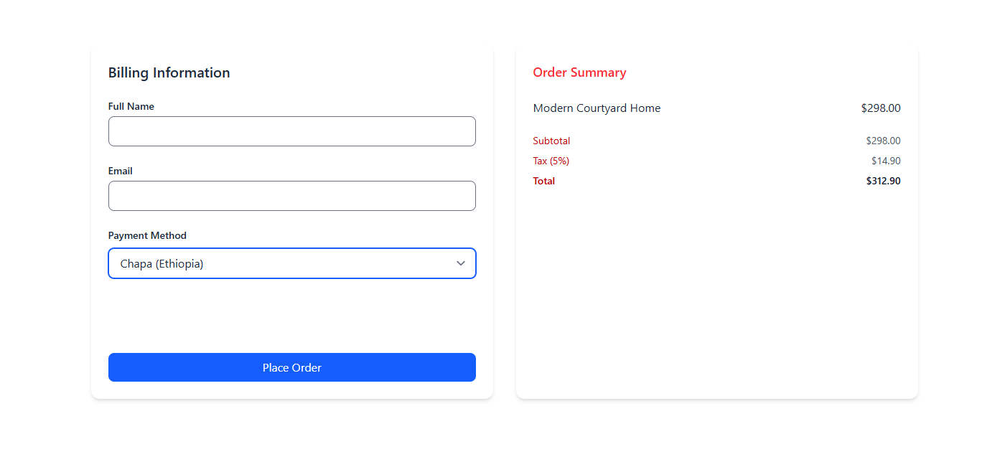

# 🏗️ BIIB Designs — Digital House Plans Marketplace 

> **A modern, responsive architecture design marketplace** built with React + TailwindCSS.  
> Enables users to browse, preview, and purchase downloadable house plans, request custom modifications, and interact with architectural services globally.

---

## 🌍 Overview

**BIIB Designs** is a **frontend web platform** designed as a **global digital marketplace** for architectural plans, 3D models, and building services.  
It focuses on **product discovery, conversion, and digital delivery**, while maintaining a clean, professional design for architecture firms and builders.

This repository contains **only the frontend implementation**, built using:
- ⚛️ **React (Vite)**
- 🎨 **TailwindCSS**
- 🧭 **React Router**
- 🛒 **Custom Hooks** for Cart, Favorites, and Authentication states

> The backend (Django REST + PostgreSQL + Chapa + PayPal integrations) is handled separately.

---

## 🚀 Features

### 🏠 A. Home / Catalog Landing
- Hero section with featured plans & CTA (“Browse Plans”, “Request Custom Quote”)
- Prominent **search bar + advanced filters** (style, size, beds, baths, stories, price, etc.)
- Carousels for:
  - Best Sellers  
  - New Releases  
  - Staff Picks  
  - On Sale items
- Quick links to popular categories (Modern, Ranch, Tiny Homes, Duplexes)

---

### 🏘️ B. Catalog / Product Listing
- Grid/List toggle layout  
- Sorting: relevance, newest, popularity, price  
- Product cards showing:
  - Thumbnail & title  
  - Specs (sqft, beds, baths, floors)  
  - File badges (PDF, DWG, SKP)  
  - Ratings & reviews  
  - Quick View modal  

---

### 🧱 C. Product Detail Page
- Large image gallery with zoom/lightbox  
- Key specs & footprint info  
- **Sample Preview** (low-res, watermarked PDF)  
- Deliverables list (PDF, DWG, SKP formats)  
- License options: personal, commercial 
- **Dynamic pricing + multi-currency**  
- “Add to Cart” & “Buy Now” buttons  
- “Request Modification” quote form  
- Embedded **YouTube tutorial / walkthrough**  
- Related products & customer reviews  

---

### 💳 D. Checkout 
- Guest checkout supported  
- Form with billing details & payment method selection  
- Placeholder for local (Chapa) & international (PayPal) integration  
- Responsive Order Summary showing subtotal, tax, total  

---

### 👤 E. Accounts & Dashboard (UI + State Management)
- Login / Register forms  
- User state stored via Context & Hooks  
- Sections:
  - Orders & Downloads  
  - License Keys  
  - Saved Plans & Wishlist  
  - Account Info / Logout  

*(Backend integration by— Django auth & JWT)*

---

### 🧾 F. Services / Custom Work
- Dedicated service pages:
  - Custom Plan Design  
  - Plan Modifications  
  - Permit-Ready Packages  
  - Consultations  
- **Quote Request Form** with:
  - File upload  
  - Brief & budget fields  
  - Optional booking calendar  

---

### 🎓 G. Tutorials & Resources
- YouTube video gallery with category filtering  
- SEO blog template (architecture tips, building guides, design trends)  
- FAQ / Knowledge Base for licensing, printing, and modification help  

---

### 💬 H. Support & Trust Signals
- Testimonials carousel  
- Partner & media logos  
- Contact form + live chat placeholder  
- Refund and license policy modals  

---

## 🧩 Tech Stack

| Layer | Technology | Description |
|-------|-------------|-------------|
| Frontend Framework | **React (Vite)** | Fast, modular, component-based frontend |
| Styling | **TailwindCSS** | Utility-first, mobile-first responsive design |
| Routing | **React Router v6** | Page navigation and dynamic product routes |
| State Management | **React Context + Custom Hooks** | Cart, Auth, Favorites, Currency, etc. |
| API Calls | **Fetch / Axios (planned)** | Communicates with Django REST backend |
| Icons | **Lucide-React** | Clean, modern icon system |
| Build Tool | **Vite** | Optimized development + production builds |

---

## 🧠 Folder Structure



---

## ⚙️ Installation & Setup

### 1️⃣ Clone the repository
```bash
git clone https://github.com/practicmakesperfact/biib-frontend.git
cd biib-frontend


2️⃣ Install dependencies

    npm install

3️⃣ Configure environment variables

Create a .env file in the project root:

VITE_API_BASE_URL=http://localhost:8000/api
VITE_EXCHANGE_API_KEY=your_currency_api_key_here

4️⃣ Run development server
npm run dev

📦 Build for Production
npm run build


## 🖼️ Screenshots

### 🏠 Home / Landing Page



### 🏘️ Catalog / Product Grid



### 📄 Product Detail


### 🛒 Cart & Checkout


🌐 Live Demo 
soon!